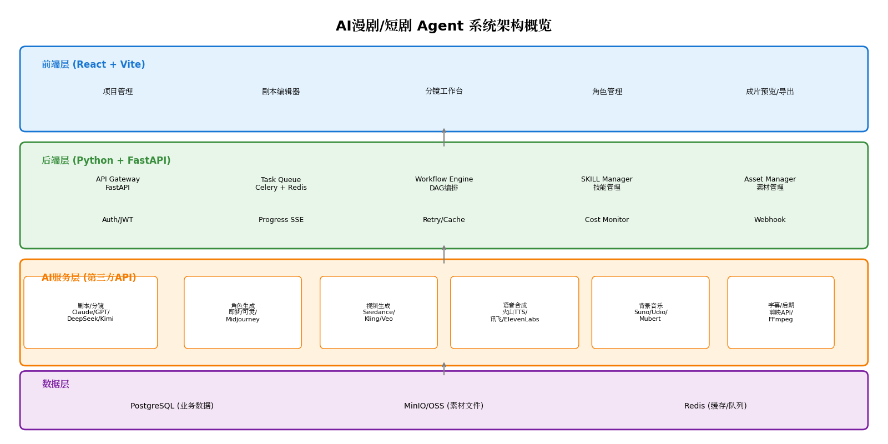
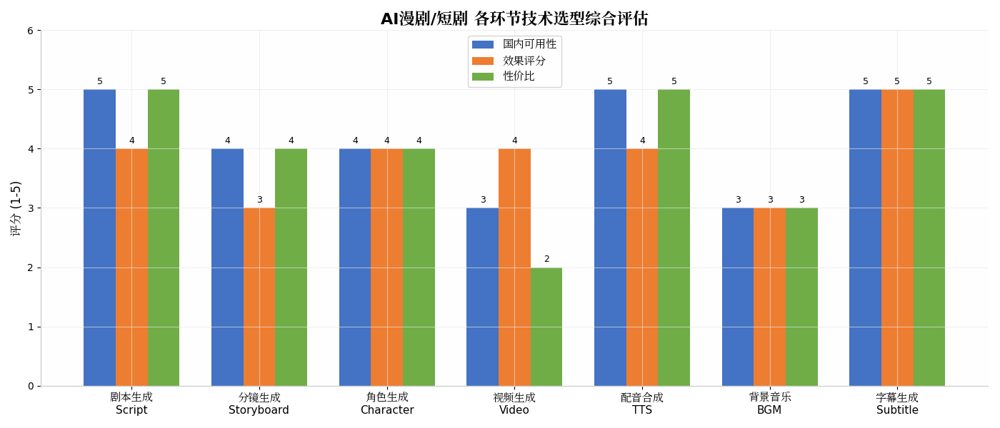
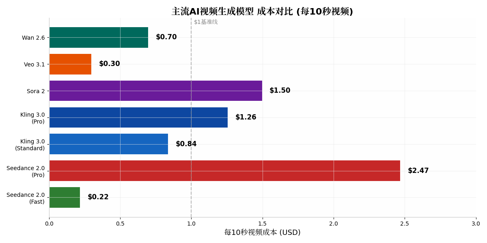

# AI漫剧/短剧 Agent — 完整技术调研与架构设计报告

## TL;DR

本项目旨在构建一个面向个人创作者的 **AI漫剧/短剧一站式生成Agent**，前端采用 **React + Vite**，后端采用 **Python + FastAPI**。核心亮点是通过 **SKILL机制** 让用户灵活选择不同风格（漫剧二次元/短剧真人），后端调用第三方API完成从剧本到成片的全流程自动化。关键技术决策为：**剧本生成**使用DeepSeek/Claude，**角色/分镜**使用即梦AI（Seedance 2.0），**视频生成**使用即梦AI/可灵AI，**配音**使用火山引擎TTS，**BGM**使用Suno/Mubert，**字幕**使用本地FFmpeg处理。后端采用 **FastAPI + Celery + Redis** 异步任务队列架构，整体单集3分钟漫剧的API成本约 **¥5-15元**，制作周期从传统数周压缩至 **1-2小时**。

---

## 一、模型选型全景图

### 1.1 整体流程与模型映射

AI漫剧/短剧的生产流程可以拆解为 **7个核心环节**：剧本生成、分镜设计、角色生成、视频生成、配音合成、背景音乐、字幕后期。每个环节都需要匹配最适合的AI模型或API服务，形成一个完整的"模型链"。下面的架构图展示了整体系统分层设计，从前端交互到后端调度再到底层AI服务的完整数据流向。



各环节技术选型需要综合考量三个维度：**国内可用性**（决定服务稳定性）、**效果质量**（决定成品观感）、**成本效率**（决定创作者负担）。下图展示了各环节在这三个维度上的综合评分，可以看到剧本生成和字幕生成是国内生态最成熟的环节，而视频生成和背景音乐则是当前技术挑战最大、成本最高的环节。



### 1.2 剧本生成：从创意到结构化剧本

剧本生成是整个流程的起点，决定了后续所有环节的内容质量。当前主流大模型在剧本创作上的表现差异明显，需要根据具体需求进行选型。

**Claude 4.6** 在剧本冲突提取和对话打磨方面表现最强，其"编剧专用版"模式可以理解复杂的人物关系和情节转折，生成的台词自然度高、戏剧冲突强烈。对于需要精细打磨对白的精品短剧，Claude是首选。但Claude的长文本连贯性略逊于Kimi，在处理超过10集的长篇连载时可能出现设定漂移。[^21^]

**GPT-5.4** 的综合能力最为均衡，其"自动格式转换"功能可以将小说或对话记录直接转化为标准剧本格式（包含场景标题、动作描述、对白等），这对于从网文IP改编漫剧的场景极为实用。GPT在模仿特定导演风格（如诺兰、昆汀）方面也有独特优势。[^23^]

**DeepSeek-V3** 是国内性价比最高的选择，每百万Token仅 **¥2-4元**，在反转剧情和多轮对话模拟方面表现突出，支持系列剧本的批量生成。其开源特性也意味着可以通过微调进一步适配漫剧领域的特殊需求。[^68^]

**Kimi** 的长文本处理能力最强（支持200万字上下文），对于需要保持长篇连载设定一致性的项目来说是最佳选择。Kimi的"炼字工坊"垂直工具更是内置了**一键跨媒介引擎**，可以直接将几十万字的小说高光剧情转化为带有 [景别]、[运镜]、[画面主体]、[音效/台词] 标记的标准分镜脚本。[^21^]

| 模型 | 剧本冲突 | 对话质量 | 长文本连贯 | 国内可用 | 成本(百万Token) | 推荐场景 |
|------|---------|---------|-----------|---------|----------------|---------|
| **Claude 4.6** | ★★★★★ | ★★★★★ | ★★★★ | ★★★ | ~¥25-30 | 精品短剧、对白打磨 |
| **GPT-5.4** | ★★★★ | ★★★★ | ★★★ | ★★★ | ~¥20-25 | IP改编、风格模仿 |
| **DeepSeek-V3** | ★★★★ | ★★★ | ★★★ | ★★★★★ | **¥2-4** | 量产短剧、成本敏感 |
| **Kimi** | ★★★ | ★★★ | ★★★★★ | ★★★★★ | ~¥5-10 | 长篇连载、小说改编 |
| **Gemini 3.1** | ★★★ | ★★★ | ★★★★ | ★★★ | ~¥10-15 | 多模态分镜、空间解析 |

### 1.3 分镜生成：从文字到视觉语言

分镜生成是将剧本转化为可视化故事板的关键环节，需要模型具备"视觉翻译"能力——将文字描述转化为包含景别、运镜、构图、光影的图像提示词。

**Gemini 2.5 Flash** 是当前分镜生成的最佳选择之一。它支持JSON模式输出结构化分镜数据，可以将剧本段落自动拆解为多条分镜描述（包含角色、动作、场景、镜头信息）。GitHub上的开源项目 `ai-storyboard-generator` 就是基于Gemini 2.5 Flash构建，实现了从剧本上传→分镜生成→图像生成→视频合成的完整工作流。[^16^]

**DeepSeek + 自定义Prompt模板** 是成本最低的分镜方案。通过精心设计的Prompt模板，可以引导DeepSeek输出符合特定格式要求的分镜脚本。实测中，一套好的分镜Prompt模板可以将分镜生成成本控制在 **¥0.1-0.3元/集**，效果接近商业工具。[^22^]

**Storyboard Hero API** 和 **Boords API** 是专业的分镜生成商业服务，提供更成熟的可视化编辑和团队协作功能，适合对分镜精度要求极高的项目。但价格较高，每集分镜生成成本在 **$1-3美元**。[^17^]

对于个人创作者，推荐采用 **DeepSeek/Kimi + 自定义分镜模板** 的方案，配合后端的模板库系统，用户可以根据不同风格（漫剧/短剧）选择不同的分镜模板（如"日漫风分镜模板"、"真人短剧分镜模板"），实现风格化分镜的低成本批量生成。

### 1.4 角色生成：一致性的核心挑战

角色一致性是AI漫剧/短剧制作中最具技术挑战的环节。如果同一角色在不同镜头中"变脸"，观众的沉浸感会被完全破坏。当前主流解决方案围绕 **角色ID机制** 和 **多图参考技术** 展开。

**即梦AI（Seedance 2.0）** 在角色一致性方面处于行业领先地位。其核心机制是：用户上传角色参考图后，系统会自动建立 **"角色ID"**，后续所有生成都会基于这个ID锁定角色的五官比例、发型特征、服装细节。实测表明，即使在场景切换、动作变化、光线变化的情况下，角色仍能保持高度一致。即梦支持多模态参考（图像+视频+音频+文本），可以一次性生成带口型同步的说话视频。[^25^][^26^]

**可灵AI（Kling 3.0）** 则通过 **"主体库"模式** 实现角色一致性。用户可以上传5张不同角度的角色设计图，AI会自动学习角色的多角度特征，生成连贯动画时人物表情、服饰细节的误差率从18%降至5%。可灵在真人化表现上更为突出，生成的角色表情自然、眼神灵动，口型与台词匹配度极高。[^35^][^58^]

对于漫剧（二次元风格），**角色生成工作流** 通常为：先用Kimi/DeepSeek生成详细的角色设定描述→用即梦AI/可灵AI生成角色立绘（正面/侧面/背面）→保存为"角色资产"→后续所有分镜都基于这些角色资产进行图生图生成。[^27^][^34^]

| 平台 | 角色一致性 | 真人质感 | 二次元风格 | 角色ID机制 | 推荐场景 |
|------|-----------|---------|-----------|-----------|---------|
| **即梦AI** | ★★★★★ | ★★★★ | ★★★★★ | 角色ID | 漫剧、连载动画 |
| **可灵AI** | ★★★★ | ★★★★★ | ★★★ | 主体库 | 真人短剧 |
| **Midjourney** | ★★★ | ★★★ | ★★★★ | 无 | 单张精品图 |
| **豆包** | ★★★★ | ★★★ | ★★★★ | 3级角色控制 | 快速分镜 |

### 1.5 视频生成：成本与质量的博弈

视频生成是整个流程中**成本最高**的环节，也是模型选型最需要精细化决策的环节。当前主流视频生成模型的价格差异极大，同样的10秒视频，成本可以从 **$0.22到$2.47** 不等。[^14^][^15^]

**Seedance 2.0（即梦AI）** 在2026年初发布后迅速成为漫剧制作的首选。其Fast模式仅需 **$0.022/秒**（约¥0.16/秒），且不排队，生成速度快。Pro模式画质更优，价格为$0.247/秒。Seedance 2.0的核心优势是**原生音频生成**（声画同步）和**角色一致性保持**，这在漫剧制作中极为关键。通过Atlas Cloud API调用可以进一步降低成本。[^14^][^18^]

**可灵AI（Kling 3.0）** 在真人短剧领域表现最强。其Standard模式约 **$0.084-0.126/秒**，Pro模式$0.112-0.168/秒。Kling 3.0的4K输出能力和**声画同出**功能（一次性生成音效、口型、音乐与画面同步的完整段落）使其成为真人短剧的专业级选择。快手的商业化数据显示，可灵AI已服务超500万用户，累计生成5100万个视频。[^19^][^58^]

**Veo 3.1（Google）** 以 **$0.03/秒** 的超低价格和原生音频生成能力成为性价比之选，但单次最长仅支持8秒，需要通过拼接实现更长视频。[^14^]

| 模型 | 每10秒成本 | 分辨率 | 最长片段 | 原生音频 | 推荐场景 |
|------|-----------|--------|---------|---------|---------|
| **Seedance 2.0 Fast** | **$0.22** | 2K | 15s | ✅ | 漫剧量产、快速迭代 |
| **Seedance 2.0 Pro** | $2.47 | 2K | 15s | ✅ | 精品漫剧、最终成片 |
| **Kling 3.0 Standard** | $0.84 | 4K | 15s | ✅ | 真人短剧、对话场景 |
| **Kling 3.0 Pro** | $1.26 | 4K | 15s | ✅ | 专业级真人短剧 |
| **Sora 2** | $1.50 | 1080p | 20s | ❌ | 复杂运镜、长镜头 |
| **Veo 3.1** | $0.30 | HD | 8s | ✅ | 低成本快速原型 |



**成本优化策略**：对于个人创作者，建议采用 **"Fast模式迭代 + Pro模式成片"** 的组合策略——用Fast模式进行分镜预览和效果验证，仅在最终导出时切换到Pro模式。此外，将长视频拆分为多个5-8秒的短片段分别生成，再拼接，可以显著降低单条失败的重试成本。[^14^]

### 1.6 语音合成：让角色"开口说话"

语音合成（TTS）的质量直接决定了角色的"灵魂感"——音色是否自然、情感是否到位、与画面是否同步。

**火山引擎TTS** 是国内漫剧/短剧制作的首选。其核心优势在于**中文口型同步适配**（配合即梦视频生成时天然对齐），价格低（**¥0.004/千字符**），且API稳定性高。火山TTS支持多种情感风格（温柔、愤怒、惊讶、悲伤等），可以为不同角色匹配不同的声音特征。[^42^]

**讯飞语音** 在情感表达方面表现最强，支持最丰富的情感标注和语气调节。价格为¥0.008/千字符，是火山的两倍，但对于需要强烈情感张力的剧情场景值得投入。[^42^]

**ElevenLabs** 是国际市场上的TTS标杆，支持28种语言和音色克隆功能。情感表达最自然，但价格高达 **$0.03/千字符**（约¥0.22/千字符），适合出海项目或对语音品质有极致要求的场景。[^42^]

| TTS引擎 | 中文自然度 | 情感表达 | 口型同步 | 价格(千字符) | 推荐场景 |
|---------|-----------|---------|---------|------------|---------|
| **火山引擎TTS** | ★★★★ | ★★★ | ★★★★★ | **¥0.004** | 国内漫剧/短剧首选 |
| **阿里云语音** | ★★★★ | ★★★ | ★★★★ | ¥0.005 | 阿里云生态项目 |
| **讯飞语音** | ★★★★★ | ★★★★ | ★★★★★ | ¥0.008 | 情感剧、高要求场景 |
| **ElevenLabs** | ★★★★★ | ★★★★★ | ★★★★ | $0.03 (~¥0.22) | 出海项目、多语言 |

### 1.7 背景音乐与音效

背景音乐和音效是营造氛围、推动情绪的关键元素。AI音乐生成领域在2025-2026年发展迅速，已有多款成熟的API服务可选。

**Suno** 是当前AI音乐生成的标杆产品，支持多语言歌词输入和多种曲风（流行、电子、嘻哈、古典等），生成质量高，适合有歌词需求的主题歌/插曲场景。[^30^]

**Mubert** 专注于免版税背景音乐的实时生成，拥有50万样本数据库，支持最长25分钟的连续音频输出。其核心优势是**免版税**——生成的音乐可直接用于商业发布，无需担心版权问题。对于视频配乐场景，Mubert的API可以直接将背景音乐叠加到原始音频轨道上。[^30^][^33^]

**Meta AudioCraft** 是开源的音乐+音效生成框架，包含MusicGen和AudioGen两个模型，支持背景音乐和音效的一体化生成。如果项目需要自部署或深度定制，AudioCraft是最佳选择。[^33^]

| 工具 | 类型 | 时长 | 版权 | 价格 | 推荐场景 |
|------|------|------|------|------|---------|
| **Suno** | 歌曲生成 | ≤4分钟 | 需确认 | 订阅制 | 主题歌、有歌词需求 |
| **Mubert** | 背景音乐 | ≤25分钟 | **免版税** | API按量 | 视频配乐、商用发布 |
| **Udio** | 歌曲生成 | ≤4分钟 | 需确认 | 订阅制 | 高质量音乐、情感表达 |
| **AudioCraft** | 音乐+音效 | 自定义 | 开源 | 免费(自部署) | 技术团队、深度定制 |

### 1.8 字幕生成与后期合成

字幕生成是技术最成熟的环节，已有大量成熟的工具和服务。

**剪映/CapCut** 是国内最常用的视频剪辑工具，其"语音转文字"功能可以自动识别视频中的语音内容并生成同步字幕，支持多种语言翻译。对于个人创作者，剪映的免费版功能已足够满足基本字幕需求。[^41^][^46^]

**本地FFmpeg + Whisper** 是技术门槛最低、成本为零的方案。OpenAI的Whisper模型可以本地运行，将音频转为带时间戳的字幕文件（SRT/VTT格式），再用FFmpeg将字幕烧录到视频中。Whisper的普通话识别准确率在标准环境下可达 **98.5%**。[^44^]

**影忆** 等AI剪辑软件提供了更智能的字幕功能，如自动去除语气词（"嗯"、"啊"）、AI配音克隆、口型匹配等高级功能。[^44^]

对于本项目，推荐采用 **Whisper本地处理 + FFmpeg合成** 的方案，将字幕生成环节完全本地化，不依赖第三方API，既降低成本又保护隐私。后端可以封装Whisper调用为内部服务，前端提供字幕样式编辑（字体、颜色、位置、动画）的可视化界面。

---

## 二、完整工作流程设计

### 2.1 从"一句话创意"到"成片输出"的全链路

AI漫剧/短剧Agent的核心价值在于将传统需要数周的人工流程压缩到 **1-2小时** 内完成。整个工作流设计遵循 **"渐进式精细化"** 原则——从粗到细、从自动到人工、从快速预览到精品输出。

完整的制作流程包含 **8个阶段**，每个阶段都有明确的输入输出和对应的技术实现：

```
┌─────────────┐    ┌─────────────┐    ┌─────────────┐    ┌─────────────┐
│  创意输入    │ → │  剧本生成    │ → │  角色设计    │ → │  分镜生成    │
│ (一句话/大纲)│    │ (结构化剧本) │    │ (角色资产库) │    │ (视觉故事板) │
└─────────────┘    └─────────────┘    └─────────────┘    └─────────────┘
                                                                ↓
┌─────────────┐    ┌─────────────┐    ┌─────────────┐    ┌─────────────┐
│  成片输出    │ ← │  后期合成    │ ← │  配音/配乐   │ ← │  视频生成    │
│ (MP4文件)   │    │ (剪辑/特效)  │    │ (TTS+BGM)   │    │ (AI视频片段) │
└─────────────┘    └─────────────┘    └─────────────┘    └─────────────┘
```

### 2.2 阶段详解与模型调用链

**Stage 1: 创意输入（用户→前端）**

用户在前端输入创意描述，如"一个关于校园霸凌的悬疑漫剧，主角是一个能看到别人记忆的转学生"。系统同时让用户选择一个 **SKILL模板**（如"日式悬疑漫剧SKILL"、"真人都市短剧SKILL"），SKILL中预定义了该风格下的模型参数、Prompt模板、视觉风格参数等。[^71^][^89^]

**Stage 2: 剧本生成（LLM API调用）**

后端调用DeepSeek/Claude的剧本生成SKILL，输入创意描述，输出结构化剧本。剧本包含：
- 分集大纲（每集标题、场景数、核心冲突）
- 场景描述（时间、地点、环境氛围）
- 角色对白（含情感标注：平静/愤怒/惊讶等）
- 镜头提示（建议景别、运镜、光影）
- 情绪弧线参数（色温、对比度、光照模式等，供后续视频生成使用）[^89^][^90^]

**Stage 3: 角色设计（图像生成API调用）**

系统从剧本中提取所有角色，调用即梦AI/可灵AI的角色生成功能，为每个角色生成：
- 角色立绘（正面、侧面、全身）
- 表情参考图（喜怒哀乐）
- 服装细节图

生成的角色图像被保存到 **角色资产库**，并建立角色ID，后续所有涉及该角色的生成都会引用这些资产以保持一致性。[^27^][^34^]

**Stage 4: 分镜生成（LLM + 图像生成API调用）**

基于剧本和角色资产，系统自动生成每集的分镜故事板：
- 每个场景拆解为3-8个分镜
- 每个分镜包含：画面描述、景别标注、运镜提示、角色动作、台词
- 调用图像生成API（即梦/可灵）将分镜描述转化为可视化分镜图

用户可以在这个环节对分镜进行人工调整——拖拽修改顺序、编辑画面描述、重新生成某张分镜图。[^16^][^17^]

**Stage 5: 视频生成（视频生成API调用）**

将分镜图批量送入视频生成模型，每个分镜生成5-10秒的AI视频片段。关键参数：
- 使用角色ID保持人物一致性
- 使用情绪弧线参数自动映射视觉风格
- Fast模式快速迭代，Pro模式最终输出

**Stage 6: 配音与配乐（TTS + BGM API调用）**

- 调用火山引擎TTS将剧本对白转为语音，为每个角色分配不同的音色
- 调用Suno/Mubert生成与剧情情绪匹配的背景音乐
- 系统根据剧本的情绪标注自动选择TTS的情感风格（温柔、愤怒、悲伤等）[^42^]

**Stage 7: 后期合成（本地FFmpeg处理）**

- 用Whisper本地生成字幕文件
- 用FFmpeg将所有视频片段、音频、字幕、BGM合成最终MP4
- 添加转场效果、片头片尾、水印等

**Stage 8: 成片输出**

用户可以在前端预览成片，选择导出不同分辨率（720p/1080p/4K）和不同格式（MP4/GIF/连帧图）的最终文件。

### 2.3 SKILL机制：让用户自定义创作风格

SKILL机制是本系统的核心创新点，它允许用户通过选择/自定义不同的SKILL来创建不同风格的漫剧/短剧。

一个SKILL是一个完整的**风格配置包**，包含：

| SKILL组件 | 说明 | 示例（日式漫剧SKILL） |
|-----------|------|---------------------|
| **剧本Prompt模板** | 引导LLM生成特定风格的剧本 | "日式校园漫剧风格，对话简洁有力，情绪表达夸张" |
| **分镜模板** | 预定义的分镜结构和视觉规范 | "日漫分镜规范，强调速度线和表情特写" |
| **角色生成参数** | 角色形象和风格锁定参数 | "日系二次元画风，大眼睛，柔和线条" |
| **视频生成模型** | 该风格推荐的视频生成模型 | 即梦AI Seedance 2.0，二次元参数 |
| **视觉参数映射** | 情绪→视觉参数的自动映射规则 | 紧张→高对比+冷色调+快速剪辑 |
| **TTS音色配置** | 推荐的角色音色组合 | 男主：沉稳低音，女主：清澈中音 |
| **BGM风格标签** | 背景音乐的风格关键词 | "anime OST, emotional piano, J-pop" |

用户可以：
1. **使用预设SKILL**（如"日式漫剧"、"真人霸总短剧"、"古风仙侠漫剧"等）
2. **修改SKILL参数**（调整风格强度、替换模型、自定义Prompt）
3. **创建自定义SKILL**（从零开始配置一套全新的风格）

LumenLine等产品的实践表明，SKILL机制可以将工具学习时间缩短到 **约2小时**，一位零经验的创作者在9个工作日内即可完成16集短剧的制作。[^89^][^90^]

---

## 三、前端页面设计与开发

### 3.1 页面结构总览

前端采用 **React 18 + Vite + TypeScript** 技术栈，UI框架推荐 **Ant Design** 或 **shadcn/ui**（Radix UI primitives + Tailwind CSS）。整体采用 **"项目管理+编辑器"** 的复合布局模式，类似于Figma/Notion的交互逻辑。

核心页面包含以下 **6大模块**：

| 页面模块 | 核心功能 | 交互特点 | 技术要点 |
|---------|---------|---------|---------|
| **项目Dashboard** | 项目列表、创建新项目、查看进度 | 卡片式布局、进度条、状态标签 | React Router、状态管理 |
| **剧本编辑器** | 剧本编写、AI续写、分集管理 | 类Notion的块编辑器、AI侧边栏 | Slate.js/Tiptap编辑器 |
| **角色管理台** | 角色创建、形象生成、资产库 | 画廊式展示、拖拽上传、批量生成 | 图片懒加载、Canvas预览 |
| **分镜工作台** | 分镜编辑、图像生成、视频预览 | 故事板布局（横向时间轴）、帧编辑器 | 虚拟滚动、WebSocket进度 |
| **成片合成室** | 片段拼接、字幕编辑、音轨调整 | 类剪映的时间轴、多轨道编辑 | Web Audio API、FFmpeg.wasm |
| **SKILL市场** | SKILL浏览、安装、自定义 | 分类筛选、参数配置面板、预览 | 表单动态渲染、JSON Schema |

### 3.2 关键页面设计细节

**剧本编辑器** 是整个产品中使用频率最高的页面。推荐采用 **三栏布局**：左侧为分集/场景导航树，中间为主编辑区（支持富文本和Markdown混排），右侧为AI助手面板（提供"续写"、"改写"、"生成对话"等快捷操作）。编辑区需要支持特殊语法高亮——如 `[场景：咖啡厅]`、`【角色：小明】`、`（情绪：愤怒）` 等漫剧剧本特有的标记语言。[^23^]

**分镜工作台** 是最具技术挑战的页面。核心交互是 **横向时间轴+故事板** 的组合模式：顶部是时间轴（显示所有分镜的缩略图和时长），中间是当前的帧编辑器（显示分镜大图、画面描述、运镜参数），底部是操作工具栏（生成图像、生成视频、重新生成、删除等）。每个分镜卡片需要显示：预览图、镜号、景别标签、时长、生成状态（等待中/生成中/完成/失败）。[^16^][^17^]

**成片合成室** 需要实现一个简化的 **非线性视频编辑器**。考虑到个人创作者的使用场景，不需要专业剪辑软件的复杂度，但至少需要：多轨道时间轴（视频轨+音频轨+字幕轨）、片段拖拽排序、片段裁剪、转场效果选择、字幕样式编辑、导出设置。技术实现上，可以使用 **FFmpeg.wasm** 在浏览器端完成轻量级的视频合成和预览，重度合成任务交给后端处理。[^44^][^45^]

### 3.3 实时进度推送

由于AI生成任务通常需要数秒到数分钟（视频生成可能需要1-2分钟），前端需要实时显示任务进度。推荐采用 **Server-Sent Events (SSE)** 技术，后端通过Celery任务的状态更新向前端推送进度信息。

进度推送的粒度设计：
- **粗粒度**：阶段级别（"正在生成剧本..."→"正在设计角色..."→"正在生成分镜..."）
- **细粒度**：任务级别（"分镜3/12生成中..."→"视频片段5/20渲染中..."）
- **实时级**：单个任务的百分比进度（通过API服务商的回调或轮询获取）

### 3.4 状态管理方案

推荐使用 **Zustand** 作为全局状态管理库（比Redux更轻量，比Context API更易用）。核心状态切片包括：

```typescript
// 核心状态结构设计
interface AppState {
  // 项目状态
  projects: Project[];
  currentProject: Project | null;
  
  // 生成任务状态
  activeTasks: GenerationTask[];
  taskProgress: Record<string, TaskProgress>;
  
  // 编辑器状态
  currentScript: Script | null;
  currentStoryboard: Storyboard | null;
  selectedShotId: string | null;
  
  // SKILL状态
  installedSkills: Skill[];
  activeSkill: Skill | null;
}
```

---

## 四、后端架构设计

### 4.1 整体技术栈

后端采用 **Python + FastAPI** 作为Web框架，核心依赖栈如下：

| 组件 | 技术选型 | 用途 |
|------|---------|------|
| **Web框架** | FastAPI | API网关、请求处理、自动文档 |
| **任务队列** | Celery + Redis | 异步任务调度、进度追踪 |
| **数据库** | PostgreSQL | 业务数据持久化（项目、剧本、角色等） |
| **对象存储** | MinIO / 阿里云OSS | 图片/视频/音频素材文件存储 |
| **缓存** | Redis | API结果缓存、速率限制、会话存储 |
| **监控** | Flower + Prometheus | 任务队列监控、性能指标采集 |
| **视频处理** | FFmpeg-python | 视频合成、转码、字幕烧录 |
| **音频处理** | Whisper (OpenAI) | 语音转文字、字幕生成 |
| **HTTP客户端** | httpx | 异步HTTP请求调用第三方API |

### 4.2 核心架构模式

后端采用 **"API Gateway + Async Task Pipeline"** 的架构模式。FastAPI负责接收前端请求并进行参数校验，将耗时操作（AI生成）派发给Celery异步执行，通过Redis作为消息中间件协调通信。[^52^][^54^]

核心架构组件及其职责：

**FastAPI Application** 作为API网关，处理所有HTTP请求。它提供两类端点：同步端点（如项目CRUD、SKILL查询）和异步端点（如生成任务提交）。异步端点提交任务后立即返回 `task_id`，前端通过轮询或SSE获取任务状态。[^52^]

**Celery Workers** 执行实际的AI生成任务。每个Worker是无状态的，可以从Redis队列中拉取任务并执行。Worker支持水平扩展——当任务量增加时，只需启动更多Worker进程即可。Worker需要实现任务进度上报（通过 `self.update_state`）和失败重试机制。[^54^][^63^]

**Redis** 承担三重角色：Celery的Broker（任务队列）、Celery的Backend（结果存储）、应用缓存（API响应缓存、速率限制计数器）。[^54^]

**Workflow Engine (工作流引擎)** 是连接各个AI服务的关键组件。它负责：
- 按照预定义的顺序调用各环节的AI API（剧本→分镜→角色→视频→配音→合成）
- 管理环节间的数据传递（将剧本输出传递给分镜生成，将分镜输出传递给视频生成）
- 实现DAG（有向无环图）编排，支持并行执行（如配音和BGM可以并行生成）
- 错误处理和自动重试（某个环节失败时可以选择重试或跳过）

**SKILL Manager** 负责加载、解析和执行SKILL配置。SKILL以JSON/YAML格式存储，包含完整的风格参数和模型配置。SKILL Manager在运行时将这些配置注入Workflow Engine，控制整个生成流程的行为。

**Cost Monitor** 是一个重要的辅助组件，用于追踪每个项目的API调用成本。它记录每个任务的模型使用量（Token数、视频秒数、图片数量等），按项目聚合成本，帮助用户控制预算。[^79^]

### 4.3 核心代码结构

```
backend/
├── app/
│   ├── __init__.py
│   ├── main.py                 # FastAPI入口
│   ├── config.py               # 配置管理
│   ├── dependencies.py         # 依赖注入
│   │
│   ├── api/                    # API路由层
│   │   ├── v1/
│   │   │   ├── __init__.py
│   │   │   ├── projects.py     # 项目管理
│   │   │   ├── scripts.py      # 剧本管理
│   │   │   ├── characters.py   # 角色管理
│   │   │   ├── storyboards.py  # 分镜管理
│   │   │   ├── generation.py   # 生成任务
│   │   │   ├── skills.py       # SKILL管理
│   │   │   └── assets.py       # 素材管理
│   │
│   ├── services/               # 业务逻辑层
│   │   ├── llm_service.py      # LLM调用(DeepSeek/Claude/GPT)
│   │   ├── image_service.py    # 图像生成(即梦/可灵/Midjourney)
│   │   ├── video_service.py    # 视频生成(Seedance/Kling/Veo)
│   │   ├── tts_service.py      # 语音合成(火山/讯飞/ElevenLabs)
│   │   ├── music_service.py    # 音乐生成(Suno/Mubert)
│   │   ├── subtitle_service.py # 字幕生成(Whisper)
│   │   ├── compose_service.py  # 视频合成(FFmpeg)
│   │   └── skill_engine.py     # SKILL引擎
│   │
│   ├── workflows/              # 工作流编排
│   │   ├── base.py             # 工作流基类
│   │   ├── comic_drama.py      # 漫剧工作流
│   │   ├── short_drama.py      # 短剧工作流
│   │   └── custom.py           # 自定义工作流
│   │
│   ├── models/                 # 数据模型(Pydantic/SQLAlchemy)
│   │   ├── project.py
│   │   ├── script.py
│   │   ├── character.py
│   │   ├── storyboard.py
│   │   ├── generation_task.py
│   │   └── skill.py
│   │
│   ├── core/                   # 核心基础设施
│   │   ├── celery_app.py       # Celery配置
│   │   ├── redis_client.py     # Redis客户端
│   │   ├── storage.py          # 对象存储封装
│   │   └── cost_tracker.py     # 成本追踪
│   │
│   └── tasks/                  # Celery任务定义
│       ├── __init__.py
│       ├── generate_script.py
│       ├── generate_character.py
│       ├── generate_storyboard.py
│       ├── generate_video.py
│       ├── generate_audio.py
│       ├── compose_final.py
│       └── workflow_runner.py
│
├── skills/                     # SKILL配置文件
│   ├── comic/
│   │   ├── japanese_school.yaml
│   │   ├── chinese_fantasy.yaml
│   │   └── modern_romance.yaml
│   ├── short/
│   │   ├── urban_boss.yaml
│   │   ├── revenge_drama.yaml
│   │   └── sweet_pet.yaml
│   └── custom/
│
├── alembic/                    # 数据库迁移
├── tests/
├── requirements.txt
├── Dockerfile
└── docker-compose.yml
```

### 4.4 异步任务流程示例

以下是一个完整的生成任务从提交到完成的流程：

```python
# 1. 前端提交生成请求
POST /api/v1/generation/submit
{
    "project_id": "proj_123",
    "stage": "full_pipeline",  # 或单独阶段: script/character/storyboard/video
    "skill_id": "japanese_school_comic",
    "creative_input": "一个关于校园霸凌的悬疑漫剧..."
}

# 2. 后端返回任务ID
{
    "task_id": "task_456",
    "status": "queued",
    "message": "任务已提交，正在排队处理"
}

# 3. Celery Worker执行Workflow
tasks/workflow_runner.py:
@app.task(bind=True, max_retries=3)
def run_full_pipeline(self, project_id: str, skill_id: str, creative_input: str):
    # Stage 1: 生成剧本
    self.update_state(state='PROGRESS', meta={'stage': 'script', 'progress': 10})
    script = generate_script(creative_input, skill_config)
    
    # Stage 2: 生成角色
    self.update_state(state='PROGRESS', meta={'stage': 'character', 'progress': 25})
    characters = generate_characters(script.characters, skill_config)
    
    # Stage 3: 生成分镜（可并行）
    self.update_state(state='PROGRESS', meta={'stage': 'storyboard', 'progress': 40})
    storyboard = generate_storyboard(script, characters, skill_config)
    
    # Stage 4: 生成视频（耗时最长）
    self.update_state(state='PROGRESS', meta={'stage': 'video', 'progress': 60})
    videos = generate_videos(storyboard.shots, skill_config)
    
    # Stage 5: 配音和BGM（可并行）
    self.update_state(state='PROGRESS', meta={'stage': 'audio', 'progress': 80})
    audio = generate_audio(script, skill_config)
    bgm = generate_bgm(script.emotion_arc, skill_config)
    
    # Stage 6: 合成最终视频
    self.update_state(state='PROGRESS', meta={'stage': 'compose', 'progress': 95})
    final_video = compose_final(videos, audio, bgm, subtitles, skill_config)
    
    return {"video_url": final_video.url, "project_id": project_id}

# 4. 前端通过SSE或轮询获取进度
GET /api/v1/generation/task_456/status
{
    "task_id": "task_456",
    "status": "PROGRESS",
    "stage": "video",
    "progress": 60,
    "detail": "正在生成分镜视频 5/12..."
}
```

### 4.5 第三方API接入策略

由于需要接入多家API服务商，推荐采用 **"统一封装层 + 多Provider切换"** 的设计模式。

**Provider抽象层** 定义统一的接口，每个具体的API服务商实现该接口：

```python
# services/base.py
class LLMProvider(ABC):
    @abstractmethod
    async def generate_script(self, prompt: str, config: dict) -> ScriptResult: ...
    
    @abstractmethod
    async def generate_storyboard(self, script: str, config: dict) -> StoryboardResult: ...

class VideoProvider(ABC):
    @abstractmethod
    async def generate_video(self, image_url: str, prompt: str, config: dict) -> VideoResult: ...
    
    @property
    @abstractmethod
    def cost_per_second(self) -> float: ...

# 具体实现
class DeepSeekProvider(LLMProvider): ...
class ClaudeProvider(LLMProvider): ...
class JimengVideoProvider(VideoProvider): ...
class KlingVideoProvider(VideoProvider): ...
```

**API Key管理** 通过环境变量或数据库配置，支持多Key轮询（避免单Key速率限制）。对于个人创作者场景，后端可以提供 **"API Key托管"** 模式——用户在前端输入自己的API Key，后端加密存储，调用时解密使用。这样每个用户使用自己的API额度，平台无需承担API成本。[^79^][^81^]

**API聚合平台** 的利用：通过接入 **OpenRouter**、**硅基流动** 或 **OneAPI** 等聚合平台，可以用一个API Key统一调用多个模型，简化Key管理。七牛云AI还支持Kling视频生成+LLM的统一接入，对于需要同时调用视频和文本模型的场景尤为方便。[^79^][^82^]

---

## 五、成本估算与商业模式

### 5.1 单集制作成本测算

以一个 **3分钟漫剧（约12-15个分镜，每个分镜5-8秒视频）** 为例，各环节的API成本如下：

| 环节 | 用量 | 单价 | 成本(元) | 说明 |
|------|------|------|---------|------|
| **剧本生成** | 5000输入Token + 3000输出Token | DeepSeek ¥4/百万Token | **¥0.03** | 一次生成，可复用 |
| **分镜生成** | 8000输入Token + 5000输出Token | DeepSeek ¥4/百万Token | **¥0.05** | 含提示词优化 |
| **角色生成** | 10张角色图 | 即梦AI ~¥0.1/张 | **¥1.00** | 一次性，多集复用 |
| **分镜图生成** | 15张分镜图 | 即梦AI ~¥0.1/张 | **¥1.50** | 每集独立 |
| **视频生成** | 15片段×6秒=90秒 | Seedance 2.0 Fast ¥0.16/秒 | **¥14.40** | 成本最高环节 |
| **语音合成** | 2000字台词 | 火山TTS ¥0.004/千字符 | **¥0.01** | 极低成本 |
| **背景音乐** | 1首3分钟BGM | Suno/Mubert ~¥1/首 | **¥1.00** | 免版税 |
| **字幕合成** | 本地处理 | Whisper免费 + FFmpeg | **¥0** | 完全免费 |
| **合计** | - | - | **~¥18** | 每集3分钟漫剧 |

**成本优化后**：使用资源包/订阅模式、Fast模式批量生成、角色资产跨集复用，实际成本可压缩到 **¥5-10元/集**。相比传统人工制作（需要画师、配音、剪辑等，单集成本数千元），AI方案成本降低了 **99%以上**。

### 5.2 技术选型总结

| 环节 | 首推方案 | 备选方案 | 核心决策依据 |
|------|---------|---------|------------|
| **剧本生成** | DeepSeek-V3 | Claude 4.6 / Kimi | 成本最低，中文效果好 |
| **分镜生成** | DeepSeek + 自定义模板 | Gemini 2.5 Flash | 模板可复用，成本低 |
| **角色生成** | 即梦AI (Seedance 2.0) | 可灵AI (Kling 3.0) | 角色一致性最强 |
| **视频生成** | Seedance 2.0 Fast | Kling 3.0 / Veo 3.1 |  cheapest，带音频 |
| **配音合成** | 火山引擎TTS | 讯飞语音 | 口型同步适配好 |
| **背景音乐** | Mubert API | Suno / AudioCraft | 免版税，价格低 |
| **字幕合成** | Whisper本地 + FFmpeg | 剪映API | 完全免费 |
| **后端架构** | FastAPI + Celery + Redis | Django + RQ | 异步能力强，生态成熟 |
| **前端框架** | React 18 + Vite + AntD | Vue 3 + Vite | 生态丰富，组件成熟 |

---

## 六、竞品分析与差异化定位

### 6.1 市场竞品概览

当前AI短剧/漫剧赛道已形成清晰的竞争格局，主要玩家可分为四类：

**平台型工具**（即梦AI、可灵AI）直接面向创作者提供Web端的视频生成服务，用户需要手动完成从剧本到成片的每一步操作。它们的优势是模型能力强、生成质量高，劣势是流程分散、角色一致性需要手动维护、缺乏工作流自动化。[^58^][^61^]

**Agent型工具**（LumenLine、Seko AI）提供了一站式的"完片引擎"，通过SKILL机制和工作流编排实现从剧本到成片的自动化。LumenLine的情绪弧线参数化系统和SKILL模板是其核心差异化优势。[^89^][^90^]

**开源方案**（ComfyUI + Qwen + 即梦）提供了最大的灵活性和可控性，适合技术能力强的创作者。但需要自己搭建和维护整个工具链，学习曲线陡峭。[^64^]

**纯剧本工具**（豆包、DeepSeek）只解决剧本生成环节，视频生成需要外接其他工具，属于创作辅助而非完片方案。[^58^]

| 产品 | 类型 | 自动化程度 | 角色一致性 | 成本 | 适合用户 |
|------|------|-----------|-----------|------|---------|
| **即梦AI** | 平台型 | 低（手动逐步） | ★★★★★ | 中 | 精品创作者 |
| **可灵AI** | 平台型 | 低（手动逐步） | ★★★★ | 中高 | 真人短剧 |
| **LumenLine** | Agent型 | **高（一键成片）** | ★★★★ | 订阅制 | 效率型创作者 |
| **Seko AI** | Agent型 | **高（批量量产）** | ★★★★ | 订阅制 | 工作室 |
| **ComfyUI方案** | 开源 | 中（需配置） | ★★★ | 低 | 技术型创作者 |

### 6.2 本项目的差异化定位

基于以上竞品分析，本项目的差异化定位建议为：

**"开源可扩展的个人创作者AI漫剧Agent"** —— 在LumenLine等闭源商业产品的基础上，增加 **开源** 和 **可扩展** 两个核心特性。

具体差异化点：

**SKILL系统的开放性**：不仅提供预设SKILL，还允许用户通过YAML/JSON格式自定义SKILL，并在社区中分享。这比LumenLine的封闭SKILL生态更具扩展性。

**模型Provider的可插拔性**：用户可以自由切换不同的API服务商（通过OpenRouter/OneAPI统一接入），也可以接入自己部署的开源模型（通过vLLM等推理框架）。这避免了被单一平台绑定的风险。[^79^][^81^]

**本地化处理能力**：字幕生成、轻量级视频合成等环节完全本地化（Whisper + FFmpeg），不依赖第三方API，降低成本的同时保护隐私。

**渐进式自动化**：支持从"全自动一键成片"到"每一步人工精修"的灵活切换。新手可以一键生成，进阶用户可以逐步接管每个环节的控制权。

---

## 七、实施路线图

### 7.1 MVP阶段（4-6周）

MVP版本聚焦 **"日式漫剧"** 单一SKILL，验证核心工作流的可行性。

| 周次 | 任务 | 交付物 |
|------|------|--------|
| **Week 1** | 后端框架搭建 + 数据库设计 | FastAPI项目骨架、PostgreSQL表结构 |
| **Week 2** | 剧本生成 + 角色生成 两个环节 | DeepSeek剧本生成API、即梦角色生成API接入 |
| **Week 3** | 分镜生成 + 视频生成 两个环节 | 分镜模板系统、Seedance视频生成API接入 |
| **Week 4** | 配音 + 字幕 + 合成 三个环节 | 火山TTS接入、Whisper字幕、FFmpeg合成 |
| **Week 5** | 前端基础页面开发 | React项目、Dashboard、剧本编辑器、分镜工作台 |
| **Week 6** | 前后端联调 + SKILL系统 | 完整工作流跑通、日式漫剧SKILL配置 |

### 7.2 扩展阶段（6-10周）

- 增加真人短剧SKILL
- 增加SKILL市场和自定义SKILL功能
- 增加多Provider切换功能
- 增加成片合成室（时间轴编辑器）
- 增加成本监控和预算控制
- 增加项目协作（分享/导出）功能

### 7.3 技术风险与应对

| 风险 | 影响 | 应对方案 |
|------|------|---------|
| **视频生成API不稳定** | 高 | 多Provider备份（即梦+可灵+Veo），自动切换 |
| **角色一致性不达标** | 高 | 角色ID+多图参考双重锁定，人工校验环节 |
| **API成本超预算** | 中 | 成本实时监控，用户自助充值API Key模式 |
| **长视频生成超时** | 中 | 分段生成+拼接策略，每段独立重试 |
| **前端视频预览性能** | 低 | 后端生成低码率预览版，正式版单独导出 |

---

## 八、总结

AI漫剧/短剧Agent是一个技术门槛较高但市场需求旺盛的领域。通过本调研报告的系统分析，可以得出以下核心结论：

**技术上完全可行**。当前AI模型在剧本生成、角色一致性、视频生成、语音合成等环节的能力已足以支撑个人创作者完成从创意到成片的完整流程。即梦AI的Seedance 2.0在角色一致性和声画同步方面的突破，使得"同一个角色在不同镜头中演戏"成为可能。[^25^][^61^]

**成本上极具吸引力**。单集3分钟漫剧的API成本可控制在 **¥5-18元**，相比传统制作降低99%以上。即使加上平台运营成本，对个人创作者来说也完全可承受。[^14^][^15^]

**架构上标准成熟**。FastAPI + Celery + Redis 的异步任务架构已在大量生产环境中验证，配合Flower监控和PostgreSQL持久化，可以支撑从个人使用到小规模商业运营的全场景。[^52^][^54^]

**差异化关键在于SKILL机制**。通过开放的SKILL系统，让用户能够自定义和分享不同风格的创作模板，是区别于即梦/可灵等封闭平台的核心竞争力。参考LumenLine的实践，SKILL机制可以将创作效率提升 **10倍以上**，工具学习时间缩短到2小时。[^89^][^90^]

**建议优先启动MVP开发**，以"日式漫剧SKILL"为切入点，快速验证核心工作流，再根据用户反馈迭代扩展。
