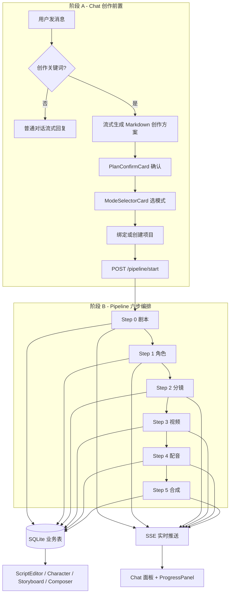

# [D-004] DramaForge 全流程规格书

**版本**: 1.0  
**日期**: 2026-06-17  
**状态**: 已实现（Step 4/5 占位，持续迭代）  
**权威来源**: 本文档为 Chat 创作 + Pipeline 六步编排的**唯一权威规格**；其他设计文档应引用本文档而非重复描述。

**关联需求**: [R-012] Chat Studio、[R-029] Pipeline 真实执行、[R-052] 数据流贯通  
**关联设计**: [D-001](chat-studio-design.md)、[D-003](pipeline-real-execution-design.md)（历史背景）

---

## 1. 端到端总览

DramaForge 的 Agent 驱动创作分为 **两个阶段**：


| 阶段    | 名称            | 触发            | 后端入口                                | 是否跑 Pipeline |
| ----- | ------------- | ------------- | ----------------------------------- | ------------ |
| **A** | Chat 创作前置     | 用户发送含创作关键词的消息 | `POST /api/v1/pipeline/chat/stream` | 否            |
| **B** | Pipeline 六步编排 | 用户确认方案并选择执行模式 | `POST /api/v1/pipeline/start` + SSE | 是            |


### 1.1 总流程图




### 1.2 关键代码锚点


| 层级           | 职责                     | 路径                                                                                                                  |
| ------------ | ---------------------- | ------------------------------------------------------------------------------------------------------------------- |
| Chat 状态      | 方案、确认、消息               | `app/src/store/useChatStore.ts`                                                                                     |
| Pipeline 状态  | 六步、面板、绑定               | `app/src/store/usePipelineStore.ts`                                                                                 |
| 启动/重试/取消     | 用户操作 API 封装            | `app/src/hooks/usePipelineExecution.ts`                                                                             |
| SSE 全局生命周期   | 切页不断流                  | `app/src/lib/pipeline-stream.ts`、`app/src/hooks/usePipelineLifecycle.ts`、`app/src/components/PipelineLifecycle.tsx` |
| 持久化与可见性      | localStorage、面板规则      | `app/src/lib/pipeline-storage.ts`                                                                                   |
| Chat UI      | 方案卡、面板、模式选择            | `app/src/pages/Chat.tsx`                                                                                            |
| 全局进度浮窗       | 任意页可见                  | `app/src/components/ProgressPanel.tsx`                                                                              |
| Pipeline 编排  | asyncio 六步执行           | `backend/app/services/pipeline_executor.py`                                                                         |
| 步骤实现         | LLM / 生图 / 生视频         | `backend/app/services/pipeline_service.py`                                                                          |
| Pipeline API | start / stream / retry | `backend/app/api/v1/pipeline.py`                                                                                    |


---

## 2. 阶段 A：Chat 创作前置

阶段 A **不写入业务表**（除 A5 新建项目时写 `projects`），所有状态在内存 Zustand 或 Chat 消息中。

### 2.1 节点明细


| 节点                 | 职责               | 输入                                                  | 产出 / 状态                                                                 | 落库                | 用户可见效果                            |
| ------------------ | ---------------- | --------------------------------------------------- | ----------------------------------------------------------------------- | ----------------- | --------------------------------- |
| **A1** 用户发消息       | 接收创意或普通对话        | 用户文本、`currentModel`、`currentSkill`                  | 追加 `user` 消息；若无会话则 `createSession()`                                    | 无                 | 消息出现在 Chat                        |
| **A2** 创作检测        | 判断是否进入创作流        | 消息文本                                                | 命中 `CREATION_KEYWORDS` → 走创作流；否则普通流式                                    | 无                 | —                                 |
| **A3** 流式生成方案      | 单次 LLM 输出人类可读方案  | 用户创意 + skill 系统 prompt                              | `creativePlanText`、`lastCreationUserMessage`；`pipelineStage='replying'` | 无                 | 流式 Markdown + `plan_confirm_card` |
| **A4** 确认方案        | 用户确认或重生成         | 点击「确认方案」/「重新生成」                                     | `planConfirmed=true`、`extractedTitle`；或重跑 A3                            | 无                 | `plan_card` + 出现模式选择              |
| **A5** 项目绑定        | 确定 Pipeline 归属项目 | URL `?projectId=` 或 `PipelineStartDialog`           | `projectId`；新建时 `POST /projects`                                        | **projects**（新建时） | 顶栏项目徽章；全局 `selectedProjectId`     |
| **A6** 启动 Pipeline | 创建 run 并订阅 SSE   | `mode`、`creative_input`、`confirmed_plan`、`skill_id` | `pipelineRunId`、`chatSessionId`、`panelOpen=true`                        | **pipeline_runs** | 右侧制作面板展开；Chat 出现进度消息              |


### 2.2 A3 方案生成规格

- **API**: `POST /api/v1/pipeline/chat/stream`
- **输出格式**: Markdown（标题、梗概、分集、角色、视觉风格、关键场景），**非 JSON**
- **Store 字段**:
  - `creativePlanText`: 方案全文
  - `planConfirmed`: 默认 `false`，确认后为 `true`
  - `lastCreationUserMessage`: 供「重新生成」使用
- **消息类型**: 流式结束后注入 `type: 'plan_confirm_card'`

### 2.3 A6 启动请求体

```json
{
  "project_id": "<uuid>",
  "creative_input": "<用户创意摘要>",
  "mode": "auto | confirm | preview",
  "skill_id": "jp-school",
  "structured_data": null,
  "confirmed_plan": "<A3 确认的 Markdown 方案全文>"
}
```

后端将 `confirmed_plan` 合并进剧本生成上下文（见 `pipeline_service.run_step_script`）。

### 2.4 前端持久化（阶段 A 边界）


| 存储           | Key / 结构                                                                  | 写入时机   | 用途                   |
| ------------ | ------------------------------------------------------------------------- | ------ | -------------------- |
| localStorage | `dramaforge_active_pipeline` → `{ pipelineId, projectId, chatSessionId }` | A6 成功  | 刷新/切页后恢复 Pipeline    |
| localStorage | `selectedProjectId`                                                       | A5 选项目 | 全局当前项目               |
| 内存           | `useChatStore.sessions`                                                   | A1–A4  | **不跨刷新**；Chat 会话仅存内存 |


### 2.5 面板可见性规则

定义于 `app/src/lib/pipeline-storage.ts`：

- `**isPipelineBoundToChat`**: 当前 Chat 是否关联进行中的 Pipeline（不要求面板展开）
  - `status === 'idle'` → 否
  - `pipelineProjectId` 与 URL/选中项目不一致 → 否
  - `pipelineChatSessionId` 与 `currentSessionId` 均非空且不一致 → 否（新建会话不显示旧任务）
  - `currentSessionId` 为空时不拦截（避免路由切换误判）
- `**isPipelineVisibleForChat`**: `isPipelineBoundToChat && panelOpen`
- **自动恢复**（`Chat.tsx`）: 绑定且非 idle 时，自动切回 pipeline 会话并 `setPanelOpen(true)`
- **全局 SSE**（`PipelineLifecycle` 挂 Layout）: 离开 Chat 不断流；30s 轮询 + 90s 无进度标记 stale

---

## 3. 阶段 B：Pipeline 六步编排

### 3.1 步骤索引


| Index | ID         | 中文  | pipeline_runs.current_step |
| ----- | ---------- | --- | -------------------------- |
| 0     | script     | 剧本  | 0                          |
| 1     | character  | 角色  | 1                          |
| 2     | storyboard | 分镜  | 2                          |
| 3     | video      | 视频  | 3                          |
| 4     | audio      | 配音  | 4                          |
| 5     | compose    | 合成  | 5                          |


全程反复更新 `**pipeline_runs`**：`status`、`current_step`、`steps_json`、`error_json`、`waiting_confirmation`。

### 3.2 三种执行模式


| 模式          | 后端行为              | SSE 特征                        | 用户操作                         |
| ----------- | ----------------- | ----------------------------- | ---------------------------- |
| **auto**    | 逐步自动执行；失败则暂停      | 连续 `step_progress`            | 失败时重试 / 跳过 / 取消              |
| **confirm** | 每步完成后等待确认         | `waiting_confirmation`        | `POST /pipeline/{id}/resume` |
| **preview** | 仅执行 Step 0–2，然后结束 | Step 2 后 `pipeline_completed` | 不生视频                         |


### 3.3 SSE 事件类型


| type                   | 触发时机                 | 主要字段                                    |
| ---------------------- | -------------------- | --------------------------------------- |
| `snapshot`             | SSE 连接建立 / 超时补发      | 完整 run 状态                               |
| `step_progress`        | 步骤开始、heartbeat、中间进度  | `step`, `progress`, 可选 `message`/`data` |
| `step_completed`       | 单步成功                 | `step`, `data`                          |
| `step_failed`          | 单步失败                 | `step`, `error`                         |
| `waiting_confirmation` | confirm 模式步间暂停       | `step`, `data`                          |
| `pipeline_completed`   | 全部完成（或 preview 提前结束） | `data`（steps 快照）                        |


**端点**: `GET /api/v1/pipeline/{pipeline_id}/stream`

---

## 4. 六步节点详细规格

以下每一步均包含：职责、输入、处理、内存快照、持久化、SSE、前端、工作台、完成标准、实现状态。

---

### Step 0 — script（剧本）


| 项        | 说明                                                                                                                |
| -------- | ----------------------------------------------------------------------------------------------------------------- |
| **职责**   | 根据创意输入 + 确认方案 + SKILL 风格，生成结构化多集剧本                                                                                |
| **输入**   | `creative_input`、`confirmed_plan`、`skill_id`、项目 `project_id`                                                      |
| **处理**   | `pipeline_service.run_step_script()` → `llm_service.generate_script()`；JSON 解析失败则文本回退 `_build_script_from_text()` |
| **实现位置** | `pipeline_executor.py` → `pipeline_service.py` L50–130                                                            |


**内存快照 `steps_json[0].data`**:

```json
{
  "title": "string",
  "episodes": [{
    "id": "ep_*",
    "number": 1,
    "title": "string",
    "scenes": [{
      "id": "s_*",
      "title": "string",
      "summary": "string",
      "location": "string",
      "time_tag": "string"
    }]
  }]
}
```

**持久化**（`_save_script`，INSERT 策略，**不覆盖**旧剧本）:


| 表               | 关键字段                                                               |
| --------------- | ------------------------------------------------------------------ |
| `scripts`       | `project_id`, `title`                                              |
| `episodes`      | `script_id`, `number`, `title`                                     |
| `scenes`        | `episode_id`, `number`, `title`, `summary`, `location`, `time_tag` |
| `script_blocks` | `scene_id`, `type='narration'`, `content=summary`                  |


**SSE**: `step_progress` 0→50（含 heartbeat）→ `step_completed`  
**Chat 消息**: `progress_update` → `step_complete`  
**前端预览**: `ScriptPreview`（`Chat.tsx`）  
**工作台**: `/script` ScriptEditor 通过 `GET /scripts?project_id=` 读取  
**完成标准**: `steps[0].status=done`，`progress=100`，DB 有 script 树  
**状态**: ✅ 已实现

---

### Step 1 — character（角色）


| 项        | 说明                                                                                      |
| -------- | --------------------------------------------------------------------------------------- |
| **职责**   | 从剧本提取角色列表，并为每个角色生成立绘                                                                    |
| **输入**   | Step 0 剧本 data、场景摘要文本                                                                   |
| **处理**   | `run_step_character()` → LLM 提取 JSON → `image_service.generate_character_image()` 逐角色生图 |
| **实现位置** | `pipeline_service.py` L133–250                                                          |


**内存快照 `steps_json[1].data`**:

```json
{
  "characters": [{
    "id": "c_*",
    "name": "string",
    "role": "主角|配角|龙套",
    "gender": "string",
    "age": 0,
    "description": "string",
    "personality": "string",
    "personality_traits": [],
    "appearance": "string",
    "costume": "string",
    "background": "string",
    "status": "done",
    "avatarColor": "#hex",
    "avatarUrl": "url|null",
    "hasGeneratedImage": true
  }]
}
```

**持久化**（`_save_characters`）:


| 表            | 关键字段                                                                                                                                                                            |
| ------------ | ------------------------------------------------------------------------------------------------------------------------------------------------------------------------------- |
| `characters` | `project_id`, `name`, `role`, `gender`, `age`, `description`, `personality`, `personality_traits`, `appearance`, `costume`, `avatar_color`, `avatar_url`, `has_generated_image` |


**SSE**: heartbeat → progress 60 → `step_completed`  
**前端预览**: `CharacterPreview`  
**工作台**: `/characters` CharacterManager  
**完成标准**: 至少 1 个角色 `status=done`  
**状态**: ✅ 已实现

---

### Step 2 — storyboard（分镜）


| 项        | 说明                                                                                                         |
| -------- | ---------------------------------------------------------------------------------------------------------- |
| **职责**   | 根据剧本 + 角色生成分镜列表，并为前 6 镜生成预览图                                                                               |
| **输入**   | Step 0/1 产出、剧本场景                                                                                           |
| **处理**   | `run_step_storyboard()` → LLM → 失败则 `_generate_shots_from_script()`；前 6 镜 `image_service.generate_image()` |
| **实现位置** | `pipeline_service.py` L253–388                                                                             |


**内存快照 `steps_json[2].data`**:

```json
{
  "shots": [{
    "id": "shot_*",
    "shot_number": 1,
    "episode_number": 1,
    "scene_title": "string",
    "description": "string",
    "shot_type": "string",
    "duration": 5,
    "camera_movement": "string",
    "composition": "string",
    "lighting": "string",
    "character_action": "string",
    "dialogue": "string",
    "characters": [],
    "status": "done",
    "imageUrl": "url|null"
  }]
}
```

**持久化**（`_save_storyboard`）:


| 表                  | 关键字段                                                                                                                |
| ------------------ | ------------------------------------------------------------------------------------------------------------------- |
| `storyboard_shots` | `project_id`, `shot_number`, `shot_type`, `duration`, `status='已完成'`, `description`, `camera_movement`, `scene_ref` |


**SSE**: progress 70 → `step_completed`；**preview 模式在此后 `pipeline_completed`**  
**前端预览**: `StoryboardPreview`  
**工作台**: `/storyboard` StoryboardWorkbench  
**完成标准**: shots 数组非空，DB 有分镜行  
**状态**: ✅ 已实现

---

### Step 3 — video（视频）


| 项        | 说明                                                                                                                                                            |
| -------- | ------------------------------------------------------------------------------------------------------------------------------------------------------------- |
| **职责**   | 按分镜逐镜调用视频生成 API，写入时间轴                                                                                                                                         |
| **输入**   | Step 2 分镜（含 `imageUrl` 作 i2v 参考）                                                                                                                              |
| **处理**   | **executor 内联**：`build_video_prompt()` 融合 SKILL/剧本/角色/连贯性；`generate_video_with_policy_retry()` — 遇 `content_policy_violation` 自动 `sanitize_video_prompt` 重试一次 |
| **实现位置** | `pipeline_executor.py` L639+；`video_prompt.py`；`video_service.py`                                                                                             |


**内容审核（Agnes 400）**:


| 现象                                                                   | 处理                                                   |
| -------------------------------------------------------------------- | ---------------------------------------------------- |
| `{"code":"content_policy_violation","message":"无法生成该内容，请调整提示词后重试。"}` | 自动弱化 prompt（去敏感词/台词引号、加 family-friendly 后缀）并重试 1 次   |
| 重试仍失败                                                                | Pipeline 暂停，`error_card` 提示「调整分镜描述后重试」；用户可点重试（气泡会消失） |
| 预防                                                                   | prompt 构建时避免暴力/色情表述；分镜 `description` 宜用英文且偏动画风格      |


**典型报错示例**:

```
镜头 2 视频生成失败: Agnes Video API 错误 (400): {"code":"content_policy_violation",...}
```

**内存快照 `steps_json[3].data`**:

```json
{
  "clips": [{
    "id": "vid_*",
    "shotId": "shot_*",
    "name": "镜头 N — 场景名",
    "duration": 5,
    "progress": 0-100,
    "status": "waiting|generating|done|failed",
    "videoUrl": "url|null"
  }],
  "overallProgress": 0-100
}
```

**持久化**:


| 表                  | 关键字段                                                                                                              |
| ------------------ | ----------------------------------------------------------------------------------------------------------------- |
| `generation_tasks` | `project_id`, `stage='video'`, `status`, `progress`, `detail`                                                     |
| `timeline_clips`   | `project_id`, `track_type='video'`, `start_time`, `duration`, `media_url`, `shot_ref`, `status='ready'`（仅成功 clip） |


**SSE**: 每镜头 `step_progress` + `data`；失败 → `step_failed`（`retryable: true`）  
**前端预览**: `VideoPreview`；Chat `error_card` 可重试  
**工作台**: `/composer` 从 timeline API 加载 clips  
**完成标准**: 全部镜头 `done` 或用户 skip；`overallProgress=100`  
**状态**: ✅ 已实现；单镜超时（如 Agnes 300s）会失败暂停  
**已知限制**: `pipeline_service.run_step_video` 存在但未接入 executor

---

### Step 4 — audio（配音）


| 项        | 说明                                                                      |
| -------- | ----------------------------------------------------------------------- |
| **职责**   | 为角色生成 TTS 配音、配置 BGM                                                     |
| **输入**   | Step 1 角色、Step 2 对白                                                     |
| **处理**   | **executor 硬编码占位**：`status='skipped'`, `reason='TTS 开发中'`               |
| **实现位置** | `pipeline_executor.py` L670–688；目标实现见 `pipeline_service.run_step_audio` |


**内存快照 `steps_json[4].data`**:

```json
{
  "status": "skipped",
  "reason": "TTS 开发中",
  "voices": [{ "characterId", "characterName", "voiceName", "status" }],
  "bgm": { "style", "duration", "status" }
}
```

**持久化**: 无业务表写入（仅 `pipeline_runs.steps_json`）  
**目标表**（未实现）: `timeline_clips`（`track_type='audio'`）、`assets`  
**SSE**: `step_completed`（无中间 progress）  
**前端预览**: `AudioPreview` 显示占位  
**工作台**: Composer 音频轨暂无 Pipeline 数据  
**完成标准**: 占位数据写入 steps_json，步骤标记 skipped/done  
**状态**: ⏳ **占位**（TTS 未接入）

---

### Step 5 — compose（合成）


| 项        | 说明                                                                      |
| -------- | ----------------------------------------------------------------------- |
| **职责**   | 将视频/音频/字幕合成为成片                                                          |
| **输入**   | Step 3 clips 时长汇总                                                       |
| **处理**   | **executor 硬编码占位**：返回 `videoUrl: null`, `status: 'ready'`, 提示「合成服务开发中」  |
| **实现位置** | `pipeline_executor.py` L690–704；目标见 `pipeline_service.run_step_compose` |


**内存快照 `steps_json[5].data`**:

```json
{
  "videoUrl": null,
  "duration": 0,
  "resolution": "1920x1080",
  "status": "ready",
  "clips": [],
  "message": "合成服务开发中，视频片段已导入合成室时间线"
}
```

**持久化**: 更新 `pipeline_runs.status='completed'`；不写入最终成片 URL  
**目标表**（未实现）: `assets`（成片文件）、`subtitle_segments`  
**SSE**: `step_completed` → `pipeline_completed`  
**前端预览**: `ComposePreview`；Chat `pipeline_complete` 消息  
**工作台**: Composer 可手动导入/编辑 timeline  
**完成标准**: `pipeline_runs.status=completed`  
**状态**: ⏳ **占位**（FFmpeg 未接入）

---

## 5. 横切能力

### 5.1 失败恢复


| API                                | 作用           |
| ---------------------------------- | ------------ |
| `POST /pipeline/{id}/retry/{step}` | 从指定步重跑       |
| `POST /pipeline/{id}/skip/{step}`  | 跳过失败步        |
| `POST /pipeline/{id}/pause`        | 暂停（取消时前端调用）  |
| `POST /pipeline/{id}/resume`       | confirm 模式继续 |


前端：`usePipelineExecution` 提供 `retryCurrentStep`、`cancelActivePipeline`；面板与 Chat `error_card` 均可触发重试。

### 5.2 项目删除

- `DELETE /api/v1/projects/{id}` 使用 SQLite FK 级联删除子表
- 涉及：`scripts`、`characters`、`storyboard_shots`、`timeline_clips`、`generation_tasks`、`pipeline_runs` 等
- 实现：`backend/app/api/v1/projects.py` + `PRAGMA foreign_keys=ON`

### 5.3 成本与素材（待办）


| 表              | 现状                                                   |
| -------------- | ---------------------------------------------------- |
| `cost_records` | 表存在，Pipeline **未自动**写入 LLM/生图/视频费用                   |
| `assets`       | 表存在，角色立绘 URL 在 `characters.avatar_url`，未统一入 assets 表 |


### 5.4 重复运行（已知限制）

同一 `project_id` 多次启动 Pipeline 会对 Step 0–2 **INSERT 新记录**，不覆盖旧剧本/角色/分镜。后续需「覆盖 / 版本化」策略。

### 5.5 Chat 与 Pipeline 消息类型


| ChatMessage.type    | 来源                                            |
| ------------------- | --------------------------------------------- |
| `plan_confirm_card` | A3 方案待确认                                      |
| `plan_card`         | A4 已确认                                        |
| `progress_update`   | SSE `step_progress`                           |
| `step_complete`     | SSE `step_completed` / `waiting_confirmation` |
| `error_card`        | SSE `step_failed`                             |
| `pipeline_complete` | SSE `pipeline_completed`                      |


---

## 6. Pipeline 步骤 → 数据表映射总表


| Step | ID         | 写入表                                      | pipeline_runs           | generation_tasks | 其他           |
| ---- | ---------- | ---------------------------------------- | ----------------------- | ---------------- | ------------ |
| A6   | start      | —                                        | INSERT                  | —                | localStorage |
| 0    | script     | scripts, episodes, scenes, script_blocks | UPDATE                  | —                | —            |
| 1    | character  | characters                               | UPDATE                  | —                | —            |
| 2    | storyboard | storyboard_shots                         | UPDATE                  | —                | —            |
| 3    | video      | timeline_clips                           | UPDATE                  | INSERT/UPDATE    | —            |
| 4    | audio      | —                                        | UPDATE                  | —                | 占位           |
| 5    | compose    | —                                        | UPDATE status=completed | —                | 占位           |


**不写入**: `subtitle_segments`（Pipeline 未实现）、`cost_records`（未自动）、`assets`（未自动）、`notifications`

---

## 7. 验收标准（Definition of Done）

与 [pipeline-e2e-checklist.md](../testing/pipeline-e2e-checklist.md) 对齐：

1. Chat：创意 → 方案流式 → 确认 → 选模式 → 启动，右侧面板显示 Step 0 进度
2. auto：Step 0–3 可跑通（Step 4–5 显示占位/跳过）
3. confirm：每步暂停，点「继续」后 `resume` 生效
4. preview：Step 2 完成后 `pipeline_completed`，无视频生成
5. 切页：ProgressPanel 仍显示；回 Chat 面板自动恢复或「打开制作面板」
6. 工作台：ScriptEditor / CharacterManager / StoryboardWorkbench / Composer 能读到 Pipeline 写入数据
7. 失败：视频步 `content_policy_violation` 自动弱化 prompt 重试；仍失败显示 error_card；重试后气泡消失
8. 删除项目：Dashboard 删除成功，无 CORS/500
9. 刷新：`dramaforge_active_pipeline` 恢复 running/paused 任务

---

## 8. 待办路线图

### P0 — 规格已定义、代码未完整实现


| 项           | 说明                                                   |
| ----------- | ---------------------------------------------------- |
| Step 4 TTS  | 接入火山引擎 TTS，写入 `timeline_clips`（audio）                |
| Step 5 合成   | FFmpeg 合成，写入 `assets` 或返回 `videoUrl`                 |
| 成本记账        | 每步 LLM/图像/视频调用写 `cost_records`                       |
| executor 统一 | video/audio/compose 改调 `pipeline_service.run_step`_* |


### P1 — 体验与数据质量


| 项                    | 说明                                 |
| -------------------- | ---------------------------------- |
| Pipeline 重跑策略        | 覆盖或版本化 script/character/storyboard |
| Chat 会话持久化           | sessions 写入 localStorage/DB        |
| 字幕自动生成               | 对白 → `subtitle_segments`           |
| `structured_data` 种子 | Chat 预提取结构化数据短路（当前未启用）             |


---

## 9. 相关 API 索引


| 方法     | 路径                                         | 说明             |
| ------ | ------------------------------------------ | -------------- |
| POST   | `/api/v1/pipeline/chat/stream`             | Chat 流式（方案/对话） |
| POST   | `/api/v1/pipeline/start`                   | 启动 Pipeline    |
| GET    | `/api/v1/pipeline/{id}/stream`             | SSE            |
| GET    | `/api/v1/pipeline/{id}`                    | 查询状态           |
| GET    | `/api/v1/pipeline/runs/latest?project_id=` | 最近 run         |
| POST   | `/api/v1/pipeline/{id}/resume`             | 继续             |
| POST   | `/api/v1/pipeline/{id}/pause`              | 暂停             |
| POST   | `/api/v1/pipeline/{id}/retry/{step}`       | 重试             |
| POST   | `/api/v1/pipeline/{id}/skip/{step}`        | 跳过             |
| POST   | `/api/v1/pipeline/save-script`             | 手动保存剧本         |
| POST   | `/api/v1/pipeline/save-characters`         | 手动保存角色         |
| POST   | `/api/v1/pipeline/save-storyboard`         | 手动保存分镜         |
| DELETE | `/api/v1/projects/{id}`                    | 删除项目（级联）       |


---

## 10. 文档修订记录


| 版本  | 日期         | 说明                                   |
| --- | ---------- | ------------------------------------ |
| 1.0 | 2026-06-17 | 首版：对齐 Phase 3 真实执行 + Chat 单次流式方案确认流程 |


