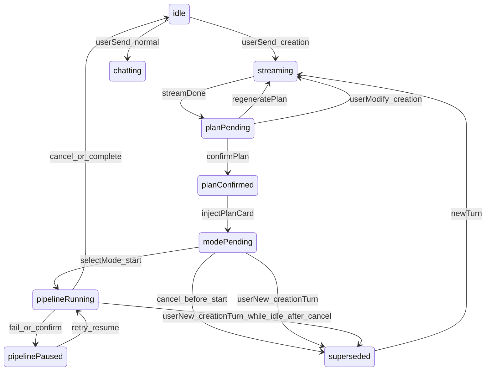

# [D-V2-C00] Chat 创作轮次状态机

**关联需求**: R-057, R-058  
**状态**: 规格已定

---

## 1. 核心概念：creationTurn（创作轮次）

一次 **creationTurn** = 从用户发起创作意图 → 方案确认 → 选模式启动 Pipeline（或放弃）。

| 字段 | 存储 | 说明 |
|------|------|------|
| creationTurnId | ChatMessage + session 级 activeTurnId | 每轮唯一 ID |
| superseded | ChatMessage | true = 历史轮次，只读 |
| activeTurnId | useChatStore | 当前可交互轮次 |

---

## 2. 状态机



---

## 3. 会话级 Chat 状态（useChatStore）

| 字段 | 说明 |
|------|------|
| creativePlanText | 当前轮方案全文 |
| planConfirmed | 当前轮是否已确认 |
| lastCreationUserMessage | 重生成用 |
| activeTurnId | 当前轮 ID |
| pipelineStage | analyzing / replying / null |
| isGenerating | 流式中 |

**persist**：sessions 已持久化；`creativePlanText` / `activeTurnId` 实现时应一并 persist 或从消息重建。

---

## 4. supersede 规则（R-057）

触发 supersede **上一轮** 所有 `plan_confirm_card` / `plan_card`：

- 用户发送新的 **创作意图** 消息（含 CREATION_KEYWORDS 或显式「重新做」）
- 用户点击「重新生成」方案
- Pipeline 已 start 后用户 cancel 并发起新创作（新 turn）
- （可选）用户确认启动 Pipeline 成功后，上一轮的 mode 卡 supersede

**不** supersede：普通闲聊、Pipeline 运行中的 progress 消息。

---

## 5. 有效卡规则（R-058）

仅同时满足以下条件的消息可交互：

```
message.type in (plan_confirm_card, plan_card)
&& message.creationTurnId === activeTurnId
&& !message.superseded
&& !pipelineRunning (plan_card 选模式时另判)
```

其余：灰底 + 「已被新方案替代」或「方案已确认」只读态。

---

## 6. 滚动

新有效卡 append 后：`messagesEndRef.scrollIntoView({ behavior: 'smooth' })`

---

## 7. 与 Pipeline 绑定

| 字段 | 说明 |
|------|------|
| pipelineChatSessionId | 启动 Pipeline 的会话 |
| chatSessionId in localStorage | 恢复用 |

新 turn 未 start Pipeline 时，旧 Pipeline 若 running：cancel 或提示「有任务进行中」— 推荐 **先 cancel 再新 turn**。

---

## 8. 验收

- [ ] 同会话两轮创作，仅最后一轮 plan 卡可点
- [ ] superseded 卡不可点
- [ ] activeTurnId 刷新后可恢复或降级提示

---

## 9. 代码锚点

`useChatStore.ts`: sendMessage, confirmPlan, regeneratePlan  
`Chat.tsx`: PlanConfirmCard, ModeSelectorCard, MessageBubble
