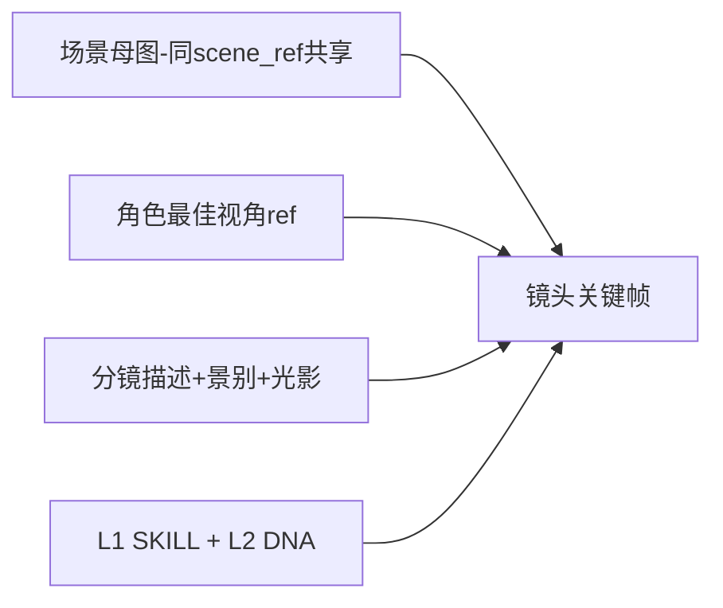

# [D-V2-P04] Step4 — keyframe（关键帧生图）

**关联需求**: R-065, R-073  
**前置**: [step-03-shot-plan.md](step-03-shot-plan.md)

---

## 1. 职责

为 **每一镜** 生成 1 张 **合成关键帧**（场景+人物+构图），写入 `storyboard_shots.keyframe_url`。

**不是**单独批量「纯场景图」或「纯人物图」。

---

## 2. 生图模型



### 2.1 场景母图（内部，非独立 Step）

- 按 `scene_ref` 分组
- 每组首次生成 1 张 **环境基调图**（无人物或极小）
- 同场景后续镜头 i2i 参考该母图

### 2.2 镜头关键帧

```
prompt = skill_block + character_dna(s) + shot.description + composition + lighting
reference_images = [scene_mood_url, character_view_url(s)]
→ generate_image 1152x768
→ UPDATE storyboard_shots SET keyframe_url=...
```

---

## 3. 输入 / 输出

| 输入 | 说明 |
|------|------|
| storyboard_shots | Step3 落库 |
| characters.assets + visual_dna | Step2 |
| recommended_view / costume_id | Step3 每镜 |

| 输出 | 存储 |
|------|------|
| keyframe_url | storyboard_shots |
| steps_json[3].data.shots[].keyframe_url | pipeline_runs |

---

## 4. SSE / UI

- progress：`镜头 3/12 关键帧生成中 45%`
- 面板：缩略图网格逐张出现
- Chat：可选 image 类型消息或仅在面板

---

## 5. 边界

| 场景 | 行为 |
|------|------|
| 单镜失败 | 该镜 status=失败；整步 paused；可 retry 单镜或整步 |
| 无 character_pack | 降级 t2i 无 ref（质量 warn） |
| 用户改分镜 description 后 | 需重跑该镜 keyframe（工作台或 retry） |
| preview 模式 | **Step4 完成后 pipeline_completed**，不跑 Step5 |

---

## 6. 重试

- `POST /retry/3`：仅重跑 failed 镜或全部（实现可选）

---

## 7. 验收

- [ ] 每镜 keyframe_url 非空（除失败镜）
- [ ] StoryboardWorkbench 可显示 keyframe 缩略图
- [ ] preview 模式无 video

---

## 8. 代码锚点

新函数 `run_step_keyframe`；`image_service.generate_keyframe_for_shot`
