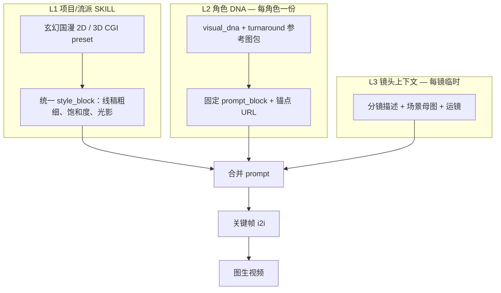

# [D-V2-S01] 角色设定包与一致性规范

**版本**: 2.0  
**状态**: 规格已定，待实现  
**关联需求**: R-067 ~ R-070（见 V2 requirements，待写）

---

## 1. 为什么角色是 V2 核心资产

成品 = 多分镜 clip 顺序组合。每一镜的关键帧与视频都依赖 **同一角色在不同角度、表情、服装下长得一样**。  
因此角色不是「一张立绘」，而是 **可跨镜头、跨集、甚至跨项目复用的设定包（Character Reference Pack）**。

---

## 2. 「3D 模型」在本项目里的含义（重要）

| 概念 | V2 是否支持 | 说明 |
|------|-------------|------|
| **3D 视觉风格**（如《完美世界》类 CGI 国漫） | ✅ | 通过 `render_mode=3d_cgi` + SKILL prompt + 参考图 img2img 实现 |
| **2D 赛璐璐**（如《斗罗大陆》《斗破苍穹》偏 2D 时期） | ✅ | `render_mode=2d_cel` + 固定线稿/上色规范 |
| **真 3D 网格文件**（.fbx / .glb / 绑定骨骼） | ❌ V2 不做 | 当前 Agnes 链路是 **图像 → 视频**，没有 3D 引擎渲染步 |
| **未来** | 可选 | 若接入 Blender/UE 或 3D 数字人 API，可新增 `model_3d_url` 字段，与设定包并列 |

**结论**：「小医仙 3D 版」在 V2 里 = **一套 3D 风格的参考图 + 固化参数**，生成视频时传入参考图与 prompt，**不是**直接加载一个 3D 模型文件。这在现有技术栈下 **可以做到**，且是国漫 AI 管线的主流做法。

---

## 3. 角色设定图分层（你提供的表格 — 规范版）

### 3.1 设定图清单

| 优先级 | asset_type | 内容 | 用途 |
|--------|------------|------|------|
| P0 | `turnaround_front` | 正面全身 | **风格锚点**；首次 t2i；后续所有图以此为 img2img 参考 |
| P0 | `turnaround_side` | 侧面全身 | 侧脸、身形、武器侧面 |
| P0 | `turnaround_three_quarter` | 3/4 侧面 | 最常用于关键帧构图 |
| P0 | `turnaround_back` | 背面全身 | 发型、披风、背部配饰 |
| P1 | `expression_neutral` | 中性表情半身 | 对白镜头基准 |
| P1 | `expression_happy` / `angry` / `sad` / `cold` | 表情变体 | 情绪场景；均以 `turnaround_front` 为参考 i2i |
| P1 | `costume_default` | 默认服装（与 turnaround 一致） | 日常/叙事 |
| P2 | `costume_battle` | 战斗服 | 打斗场景 |
| P2 | `costume_formal` | 正装/礼服 | 特殊场景 |

**生成顺序**（强制）：

```
1. turnaround_front  （t2i + 项目 SKILL + 角色 DNA prompt）
2. side / three_quarter / back  （i2i，reference = turnaround_front）
3. 表情变体  （i2i，reference = front 或 expression_neutral）
4. 服装变体  （i2i，reference = front，prompt 中替换 costume 段）
```

与现有代码的关系：V1 仅生成单张 `立绘`（见 `generate_character_portraits`）；V2 扩展为上述 asset 列表写入 `characters.assets_json`。

---

## 4. 角色一致性的两层手段（你提到的方案 — 规范固化）

### 4.1 图生图（img2img）— 主手段

- 首张 `turnaround_front` 文生图
- 后续所有视角/表情/服装：**Agnes `extra_body.image` = 锚点 URL**
- 项目内其他角色：可选第二锚点为「项目首张主角 front」（V1 已有 `style_reference_url` 跨角色风格统一）

现有实现入口：[`backend/app/services/image_service.py`](../../../backend/app/services/image_service.py) `generate_character_image()`。

### 4.2 固定 Prompt 模板（Character DNA）— 辅手段

把外貌、发色、瞳色、服装、标志性配饰等 **固化成一段英文/中英混合文本**，每次关键帧/视频生成 **拼在 prompt 最前**，不随 LLM 自由发挥。

建议新增字段 `characters.visual_dna`（JSON 或 Text）：

```json
{
  "prompt_block_en": "Xiao Yixian, female, purple hair twin tails, green eyes, poison master, purple white hanfu with silver trim, jade pendant, ethereal aura",
  "prompt_block_zh": "小医仙，紫发双马尾，绿眸，毒宗气质，紫白相间汉服银边，玉佩",
  "immutable_traits": ["purple hair", "green eyes", "jade pendant"],
  "render_mode": "3d_cgi",
  "skill_preset_id": "xuanhuan-3d-v1"
}
```

生成关键帧或视频时：

```
final_prompt = project_skill_block + character.visual_dna.prompt_block_en + shot_description
i2i_reference = pick_best_view(shot_angle, character.assets)  // 侧面镜用 side，默认用 three_quarter
```

### 4.3 视频步如何使用

| 输入 | 来源 |
|------|------|
| `image_url` | 该镜 **关键帧**（已融入角色+场景） |
| prompt 中的角色段 | `visual_dna.prompt_block` + 出场角色列表 |
| 可选 extra ref | 该镜出场角色的 `turnaround_three_quarter` URL（加强一致性） |

---

## 5. 需要持久化什么（做到可复用）

### 5.1 已有（V1）

| 字段 | 表 | 用途 |
|------|-----|------|
| appearance, costume, personality… | `characters` | 文本设定 |
| avatar_url | `characters` | 主图 |
| assets_json | `characters` | `[{type, name, thumbnail}]`，类型过粗 |

### 5.2 V2 新增（建议）

| 字段 | 类型 | 用途 |
|------|------|------|
| `visual_dna` | JSON | 固化 prompt 块 + immutable_traits |
| `render_mode` | enum | `2d_cel` / `3d_cgi`，可继承项目默认 |
| `style_anchor_asset_id` | string | 指向 assets 中 `turnaround_front` |
| `assets_json[]` 扩展 | | 见下 |

**assets_json 单条扩展**：

```json
{
  "id": "asset_xxx",
  "type": "turnaround_front",
  "view": "front",
  "expression": "neutral",
  "costume_id": "default",
  "render_mode": "3d_cgi",
  "thumbnail": "https://...",
  "prompt_snapshot": "生成该图时使用的完整 prompt",
  "is_style_anchor": true,
  "generation_task_id": "task_xxx"
}
```

### 5.3 跨项目复用（「库里的一个小医仙」）

V2 路径：

1. **项目内复用**：同一 `project_id` 下所有分镜/关键帧/视频读 `characters` 表即可（已满足大部分需求）
2. **跨项目复用**：在素材库 [`assets`](../../../backend/app/models/db_models.py) 表增加 `character_preset` 类型，或「从角色导出预设」→ 新项目「导入角色预设」克隆 `visual_dna + assets_json`
3. **SKILL 市场**：发布的是 **风格 preset**（玄幻 3D 上色规范），不是某个 IP 角色的侵权拷贝；具体角色仍用 Character DNA 描述

---

## 6. SKILL 要不要单独做？— 三层结构

**要，但不是「每个角色一个 SKILL 市场条目」**，而是三层分工：



| 层级 | 名称 | 存哪 | 谁维护 | 示例 |
|------|------|------|--------|------|
| **L1** | 流派 SKILL | `projects.skill_id` + `skills.parameters` | Skill 市场 / 创建项目时选 | 「玄幻国漫 3D」「赛璐璐 2D 校园」 |
| **L2** | 角色 DNA | `characters.visual_dna` + `assets_json` | Pipeline Step2 / 角色管理台 | 小医仙：紫发、毒宗、default/battle 服装包 |
| **L3** | 镜头 prompt | 分镜字段 + 关键帧任务 | Pipeline Step3/4 | 「中景，3/4 侧，毒雾缭绕」 |

**L1 管画风，L2 管脸和衣服，L3 管这一镜怎么拍。**  
角色不需要在 Skill 市场里再建一条「小医仙 SKILL」；小医仙是 **L2 角色资产**，流派是 **L1 SKILL**。

---

## 7. 与 Pipeline 五步的衔接

| Step | 角色设定包的作用 |
|------|------------------|
| 1 剧本 | 提取角色名单 → 初始化 `characters` 行 + 空 DNA |
| 2 角色包 | 按 §3 生成全套参考图，写入 `assets_json` + `visual_dna` |
| 3 分镜规划 | 每镜标注出场角色 + 推荐视角 + 服装 variant |
| 4 关键帧 | i2i：场景母图 + **该镜最佳视角 reference** + DNA prompt |
| 5 视频 | i2v：关键帧 + DNA prompt 片段 |

---

## 8. 验收标准（Definition of Done）

1. 每主角至少 P0 四视角 reference 落库且可在角色管理台查看
2. 同一角色连续生成 3 张关键帧，发型/服装/配饰无明显漂移（人工抽检）
3. 切换 `render_mode` 后重新生成 front，side/back 跟随 i2i 一致
4. 换服装 variant 只改 costume 相关 prompt 段，脸型/发色不变
5. 生成视频时 backend 日志可见：`visual_dna` + `reference_url` 已传入
6. （P2）支持「导出角色预设」并在新项目导入

---

## 9. 实现锚点（当前代码）

| 模块 | 路径 | V2 改动方向 |
|------|------|-------------|
| 批量立绘 | `image_service.generate_character_portraits` | 改为 `generate_character_reference_pack` |
| 单角色生图 API | `POST /images/generate-character` | 支持 `view` / `expression` / `costume_id` 参数 |
| 角色 schema | `CharacterAssetData` | 扩展 view、expression、costume_id、is_style_anchor |
| Pipeline Step2 | `pipeline_service.run_step_character` | 调用 reference pack 而非单立绘 |
| 视频 prompt | `video_prompt.build_video_prompt` | 注入 `visual_dna.prompt_block` |

---

## 10. 参考审美（非 IP 复制）

SKILL preset 描述的是 **技法层级**，不内置受版权保护的具体角色：

| preset | 参考技法 | render_mode |
|--------|----------|-------------|
| 玄幻国漫 2D | 赛璐璐、清晰线稿、高饱和、偏《斗罗》早期 2D 期 | `2d_cel` |
| 玄幻国漫 3D | 全 3D 渲染、材质细腻、偏《完美世界》 | `3d_cgi` |
| 玄幻国漫 2D+特效 | 2D 主体 + 粒子/斗气特效层 | `2d_cel` + fx flag |

具体「小医仙」由用户剧本 + L2 Character DNA 定义，不打包进 SKILL 安装包。
